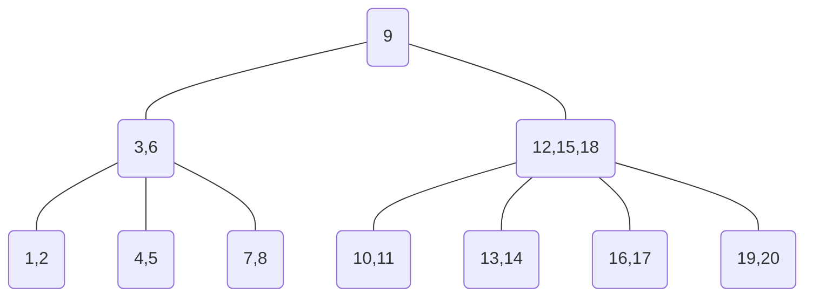

# B-Tree

> The following statement is a quote from [Introduction to Algorithms](https://en.wikipedia.org/wiki/Introduction_to_Algorithms) and [https://github.com/raywenderlich/swift-algorithm-club](https://github.com/raywenderlich/swift-algorithm-club/blob/master/Bucket%20Sort/README.markdown).

B-trees are balanced search trees designed to work well on magnetic disks or other direct-access secondary storage devices. B-trees are similar to Red-Black trees, but they are better at minimizing disk I/O operations. Many database systems use B-trees, or variants of B-trees, to store information.

B-trees differ from red-black trees in that B-tree nodes may have many children, from a handful to thousands. That is, the "branching factor" of a B-tree can be quite large, although it is usually determined by characteristics of the disk used. B-trees are similar to red-black trees in that every n-node B-tree has height O(lg n), although the height can be considerably less than that of a red-black tree.

B-trees generalize BST in a natural member.

## Definition of B-Trees

A **B-Tree** `T` is a rooted tree (whose root is `T.root`) having the following properties:

1.  Every node `x` has the following fields:
    **a**. `x.n`,the number of keys currently stored in node `x`,
    **b**. the `x.n` keys themselves, stored in nondecreasing order, so that `x.key(1)`<=`x.key(2)`<=...<=`x.key(x.n)`,
    **c**. `x.leaf`, a boolean value that is `TRUE` if `x` is a leaf and `FALSE` if `x` is an internal node.
2.  Each internal node `x` also contains `x.n+1` pointers `x.c(1)`, `x.c(2)`,..., `x.c(x.n+1)` to its children. Leaf nodes have no children, so their `c(i)` fields are undefined.
3.  The keys `x.key(i)` separate the ranges of keys stored in each subtree：If `k(i)` is any key stored in the subtree with root `x.c(i)`, then

<!---->

    k(1)<=x.key(1)<=k(2)<=x.key(2)<=...<=x.key(x.n)<=k(x.n+1)

1.  All leaves have the same depth, which is the tree's height `h`.
2.  There are lower and upper bounds on the number of keys a node can contain. These bounds can be expressed in terms of a fixed integer `t>=2` called the **minimum degree** of the B-Tree:
    **a**. Every node other than the root must have at least `t-1` keys. Every internal node other than the root thus has at least `t` children. If the tree is nonempty, the root must have at least one key.
    **b**. Every node can contains at most `2t-1` keys. Therefore, an internal node can have at most `2t` children. We say that a node is **full** if it contains exactly `2t-1` keys.

The simplest B-tree occurs when `t=2`. And in this case, we have a **2-3-4 tree**.

A second order B-Tree with keys from 1 to 20 looks like this:

## Basic operations on B-trees

**Searching**

Searching a B-tree is much like searching a BST, except that instead of making a binary, or "two-way", branching decision at each node, we make multiway branching decision according to the number of the node's children.

The time complexity of searching a B-tree is `O(t log(t)n)`.

**Insertion**

Keys can only be inserted to leaf nodes.

1.  Perfrom a search for the key `k` we want to insert.
2.  If we haven't found it and we are on a leaf node, we can insert it.

*   If after the search key `l` which we are standing on is greater than `k`: We insert `k` to the position before `l`.
*   Else: We insert `k` after `l`.
    After insertion we should check if the number of keys in the node is in correct range.If not, we need to split the node.

**Spliting a node**

**Removal**

(to be completed)

## Implementation

[Here](https://github.com/janwee-sha/algorithms/blob/main/src/main/java/tree/BTree.java) is a implementation of B-tree.