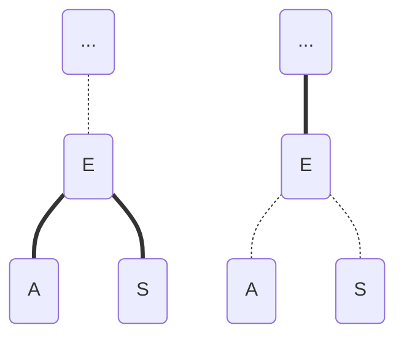

# Red-Black Tree
> 以下描述摘自Robert Sedgewick和Kevin Wayne的《算法（第4版）》

红黑二叉查找树背后的思想使用标准的二叉查找树和一些额外的信息（替换3-结点）来表示2-3树。将树中的链接分为两种类型：

*   **红链接**，始终左斜的红色链接相连的两个2-结点构成一个3-结点
*   **黑链接**：2-3树中的普通链接。

## 红黑树的属性：

*   红链接均为左链接；
*   没有任何一个结点同时和两条红色链接相连；
*   该树是**完美黑色平衡**的，即任意空链接到根节点的路径上的黑链接数量相同。

## 旋转

（围绕x的）左旋：

          |                |
          x                y
        /   \            /   \
      [A]    y    ->    x    [C]
            / \        / \
          [B] [C]    [A] [B]

（围绕y的右旋）：

          |                |
          x                y
        /   \            /   \
      [A]    y    <-    x    [C]
            / \        / \
          [B] [C]    [A] [B]

## 颜色转换

我们用`FLIP_COLOR`方法来转换一个结点的两个红色子结点的颜色，将子结点的颜色由红变黑，同时将父结点的颜色由黑变红：

> 虚线代表黑链接，实线代表红链接

## 插入

2-3树中的插入算法需要我们分解，将中间腱插入父结点，直至遇到一个2-结点或是根节点。在沿着插入点到根节点的路径向上移动时的情况的对应处理方式：

*   若右子结点是红色而左子结点是黑色的，进行左旋转；
*   若左子结点是红色的且它的左子结点也是红色的，进行右旋转；
*   若左右子结点均为红色，进行颜色转换。

## 实现

[这里](https://github.com/janwee-sha/algorithms/blob/main/src/main/java/RedBlackTree/RBBST.java)是按以上思想实现的红黑树。